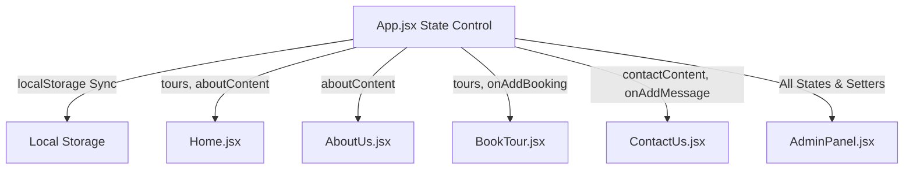

# Implementation Plan - Admin Panel and Content Management System

This plan outlines the design and implementation of an Admin Panel (`AdminPanel.jsx`) with `localStorage`-backed state persistence, allowing real-time edits to all website contents, catalog management, and request monitoring.

## Architectural Changes

To make the website dynamically editable, we will lift the state of tours, page texts, contact info, and booking lists up to `App.jsx`, sync it to `localStorage`, and distribute it down via React props.

---

## Proposed Changes

### 1. New Component

#### [NEW] [AdminPanel.jsx](file:///c:/Users/jitsi/OneDrive/Desktop/RED%20KITE%20TOURISM/src/pages/AdminPanel.jsx)
- **Login screen**: Prompts for password (default `123456`). Uses clear error states.
- **Admin Dashboard Tabs**:
  - **Booking Requests**: Table of submitted tour reservations (Tour name, Date, Name, Mobile, Quantity, Status: Pending/Accepted/Rejected). Actions to Accept, Reject, or Delete.
  - **Contact Messages**: Table of contact inquiries (Name, Email, Type, Message) with Mark-as-Read/Delete options.
  - **Manage Tours (CRUD)**: List of tours. Includes forms to Add, Edit, or Delete tours with fields: Title, Tagline, Description, Image URL, Duration, Best Time, Difficulty, Landscape.
  - **Edit Pages Content**: Text inputs to edit:
    - About Us (Story headings, description paragraphs, mission statement).
    - Contact Us (Proprietor name, phone, email, address, Google Maps embed link).
    - Footer details and Social links (Instagram, Twitter, Mail).

### 2. Centralizing State in App.jsx

#### [MODIFY] [App.jsx](file:///c:/Users/jitsi/OneDrive/Desktop/RED%20KITE%20TOURISM/src/App.jsx)
- Initialize all content variables from `localStorage` (with fallback to default Sikkim & Meghpiyon values).
- Implement state hooks:
  - `tours`, `aboutContent`, `contactContent`
  - `bookingRequests` (stores user reservations)
  - `contactMessages` (stores contact form inputs)
- Add handlers:
  - `onAddBookingRequest(req)`
  - `onAddContactMessage(msg)`
  - `onUpdateTours(toursList)`
  - `onUpdateAboutContent(aboutObj)`
  - `onUpdateContactContent(contactObj)`
- Integrate the `'admin'` page route rendering `<AdminPanel>`.
- Add an `"Admin Access"` link in the footer copyright area.

### 3. Component Adaptations

#### [MODIFY] [Home.jsx](file:///c:/Users/jitsi/OneDrive/Desktop/RED%20KITE%20TOURISM/src/pages/Home.jsx)
- Remove hardcoded default tours and description structures.
- Accept `tours` and `aboutContent` as props and render them dynamically.

#### [MODIFY] [AboutUs.jsx](file:///c:/Users/jitsi/OneDrive/Desktop/RED%20KITE%20TOURISM/src/pages/AboutUs.jsx)
- Remove hardcoded text descriptions.
- Accept `aboutContent` as props and render it dynamically.

#### [MODIFY] [ContactUs.jsx](file:///c:/Users/jitsi/OneDrive/Desktop/RED%20KITE%20TOURISM/src/pages/ContactUs.jsx)
- Accept `contactContent` and `onAddContactMessage` as props.
- On contact form submission, trigger `onAddContactMessage(newMsg)` to add the inquiry to the admin inbox, and display the confirmation modal.

#### [MODIFY] [BookTour.jsx](file:///c:/Users/jitsi/OneDrive/Desktop/RED%20KITE%20TOURISM/src/pages/BookTour.jsx)
- Accept `tours` and `onAddBookingRequest` as props.
- On reservation form submission, trigger `onAddBookingRequest(newReq)` to add the reservation to the admin dashboard, and display the confirmation modal.

---

## Verification Plan

### Automated Build Verification
- Execute `npm run build` to verify compiling success.

### Manual Verification Flow
- Navigate to the page, scroll to the footer, and click **Admin Access**.
- Log in with `123456`.
- Add a new tour, edit an existing tour, and verify that changes show up on the Book Tour and Home pages.
- Submit a booking request as a user, log back into the Admin Panel, and verify the request is logged and can be Accepted/Rejected.
- Edit Contact details and verify they update on the Contact Us page and footer in real-time.
